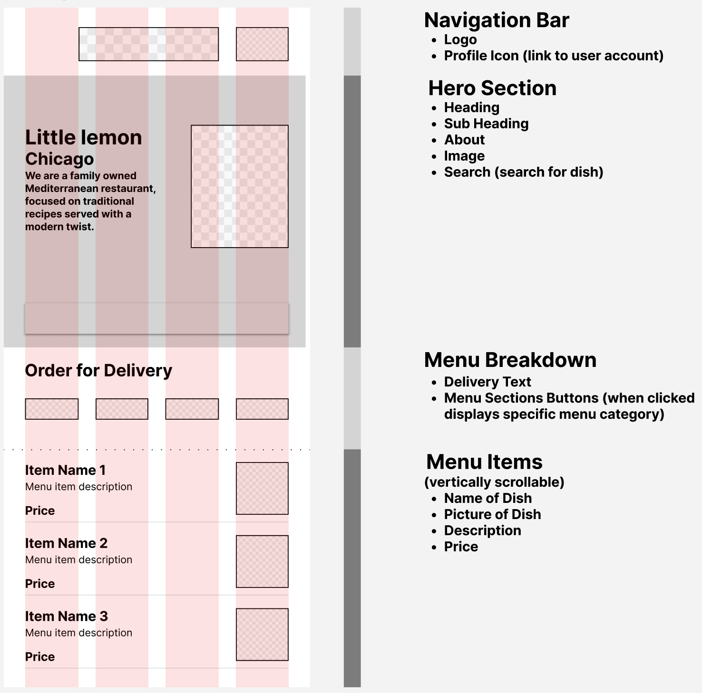
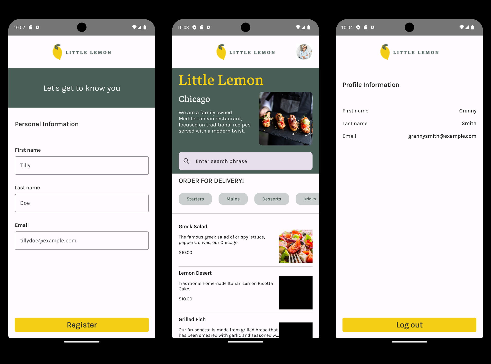

# Little Lemon Food Ordering App
Android App Capstone from the Meta Android Developer Professional Certificate.

## About This Project
This app was created by Brandon Wylie as the final project of the Meta Android Developer Professional Certificate program on Coursera. Its purpose is to serve as a restaurant menu with an onboarding, home, and profile screen.

**Note:** The images for two menu items (Lemon Dessert and Grilled Fish) are just black squares from the official course repo. This is not a bug from this project, but an issue in the course content.

Technology stack: Android, Kotlin.

## Wireframe

The wireframe of the app home screen, designed in Figma.

## App Screenshots

In-app screenshots of the onboarding, home, and profile screens.

## How To Use
### Running the project
1. Ensure that you are running the latest version of [Android Studio.](https://developer.android.com/studio)
2. Add the root folder of this repo as a project in Android Studio.
3. Run the app on the emulator of your choice or on a physical Android device.
